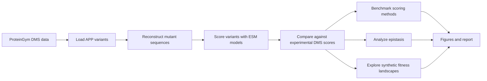

# ESM DeepLearning

**ESM DeepLearning** is a protein language model benchmarking project for predicting mutation effects in the human Amyloid Precursor Protein (**APP / A4_HUMAN**). It compares probability-based and embedding-based scoring methods across ESM models, then evaluates how well those model scores match experimental Deep Mutational Scanning data.


## What This Project Does



The project focuses on `A4_HUMAN_Seuma_2021`, a ProteinGym dataset for APP with roughly 14,483 variants, including a large number of double mutants. That makes it useful for testing both single-mutant prediction and epistasis.

## Core Questions

- Can ESM protein language models predict experimental mutation effects?
- Do larger models improve variant-effect prediction?
- Are probability scores or embedding-space geometry better predictors?
- Do model scores capture double-mutant interactions, or epistasis?
- Can the models be used to explore synthetic protein fitness landscapes?

## Models And Scoring Methods

Models used:

- `facebook/esm2_t30_150M_UR50D`
- `facebook/esm2_t33_650M_UR50D`
- ESM-1v variant models

Scoring methods implemented in `src/scoring.py`:

- `MLLR`: masked log-likelihood ratio at mutated sites
- `PLL`: pseudo-log-likelihood of the full sequence
- `LLR`: mutant vs wild-type PLL comparison
- `EDS`: embedding distance from wild type
- `EntropyMLLR`: entropy-weighted MLLR
- `EnsembleMLLR`: robust MLLR with context perturbation
- `MutantMarginal`: mutant-only marginal probability

## Repository Layout

```text
.
|-- src/                 # Core Python code for loading, scoring, validation, and analysis
|-- data/                # ProteinGym input data and reference metadata
|-- results/             # Active result outputs used by analysis scripts
|-- report/              # LaTeX report source and compiled report
|-- report_figures/      # Figures referenced by report/report.tex
|-- scripts/
|   |-- hpc/             # RAVEN / SLURM scoring and analysis jobs
|   `-- setup/           # RAVEN environment setup scripts
|-- docs/                # Project notes and method documentation
|-- artifacts/           # Archived top-level figures, metrics, and legacy outputs
`-- requirements.txt
```

`data/`, `results/`, and `report_figures/` intentionally remain at the repository root because the existing Python, HPC, and LaTeX workflows refer to those paths.

## Quick Start

Create a Python environment:

```bash
python -m venv .venv
source .venv/bin/activate
python -m pip install --upgrade pip
python -m pip install -r requirements.txt
```

Run a small scoring job:

```bash
python -m src.batch_scoring \
  --input_csv data/A4_HUMAN_Seuma_2021.csv \
  --output_csv results/example_eds.csv \
  --method EDS \
  --model facebook/esm2_t30_150M_UR50D \
  --model_type esm2 \
  --max_samples 10
```

Analyze model predictions against experimental DMS scores:

```bash
python -m src.analysis \
  --results_csv results/example_eds.csv \
  --truth_csv data/A4_HUMAN_Seuma_2021.csv \
  --output_report results/example_eds_report.png
```

## HPC Workflow

RAVEN / SLURM scripts live in `scripts/hpc/`. Run them from the repository root, or submit the moved script path directly:

```bash
sbatch scripts/hpc/RAVEN_EDS_150M.sh
```

Environment setup scripts live in `scripts/setup/`:

```bash
bash scripts/setup/SETUP_ENV.sh
```

The shell scripts self-locate to the repository root before running so their existing `data/` and `results/` paths continue to work after the cleanup.

## Documentation

- [Dataset selection details](docs/dataset_selection_details.md)
- [Scoring methods details](docs/SCORING_METHODS_DETAILS.md)
- [Report outline](docs/REPORT_OUTLINE.md)
- [Compiled project report](report/report.pdf)

## Notes

This is a research codebase, not a packaged application. The important reusable pieces are in `src/`; the `results/`, `report/`, `report_figures/`, and `artifacts/` folders preserve the experimental outputs and reporting context.
